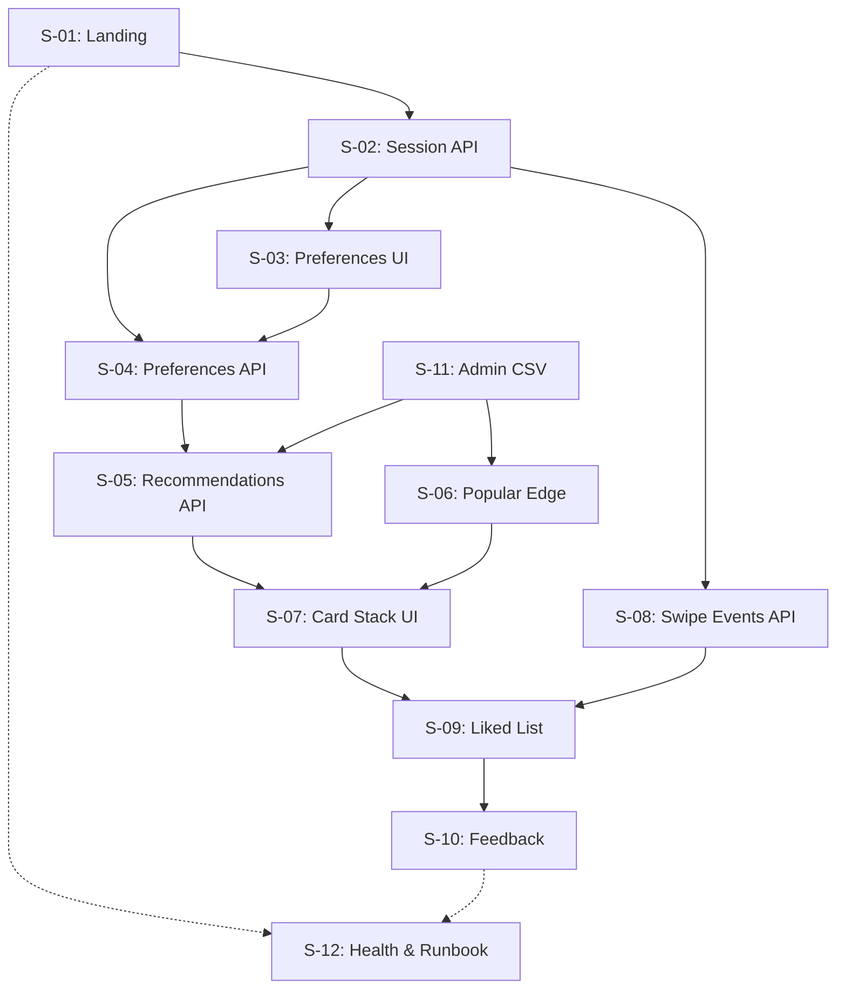

# Core Validation Epic - Story Index

## Epic Overview

**Epic:** Core Validation Platform
**Epic Goal:** Create a functional web application that proves Thai students will use a simple tool for faster travel decisions, with comprehensive validation metrics to guide future development.

**Timeline:** 8 weeks (September 23 - November 25, 2025)
**Total Stories:** 12
**Combined Effort:** 6 days of development work

## Story Backlog

### Critical Path Stories (Frontend → Backend → Integration)

#### 1. Session Management & Onboarding
- **[S-01: Landing & Onboarding](./S-01-landing-onboarding.md)** (0.5 days)
  - Landing page with anonymous session creation
  - PDPA-compliant analytics consent
  - "Start Swiping" user journey initiation
  - **Dependencies:** None
  - **API:** POST /api/sessions

- **[S-02: Anonymous Session API](./S-02-anonymous-session-api.md)** (0.5 days)
  - Backend session management with PDPA compliance
  - Session validation middleware
  - 7-day cookie-based persistence
  - **Dependencies:** None
  - **API:** POST/GET/DELETE /api/sessions

#### 2. Preference Input & Storage
- **[S-03: Preferences UI](./S-03-preferences-ui.md)** (0.5 days)
  - Visual preference form (budget, mood, time, transport)
  - Mobile-optimized touch interactions
  - Thai/English localized interface
  - **Dependencies:** S-01, S-02
  - **API:** Consumes S-04 API

- **[S-04: Preferences API](./S-04-preferences-api.md)** (0.5 days)
  - Preference storage with Zod validation
  - Budget/mood/time/transport schema
  - Database optimization with indexes
  - **Dependencies:** S-02
  - **API:** PUT /api/sessions/{id}/preferences

#### 3. Recommendation Engine & Fallback
- **[S-05: Recommendations API](./S-05-recommendations-api.md)** (0.5 days)
  - Core recommendation engine with preference filtering
  - Circuit breaker with 800ms timeout
  - Bangkok destination filtering logic
  - **Dependencies:** S-04, S-11
  - **API:** GET /api/recommendations

- **[S-06: Popular Recommendations (Edge)](./S-06-popular-recommendations-edge.md)** (0.5 days)
  - Fast Mode fallback system
  - Edge-cached popular destinations
  - Sub-second response times for degraded performance
  - **Dependencies:** S-11
  - **API:** GET /api/recommendations/popular

#### 4. Core User Experience
- **[S-07: Card Stack UI](./S-07-card-stack-ui.md)** (0.5 days)
  - Tinder-style swipe interface
  - Mobile gesture optimization
  - Card animations and visual feedback
  - **Dependencies:** S-05, S-06
  - **API:** Consumes S-05/S-06 APIs

- **[S-08: Swipe Events API](./S-08-swipe-events-api.md)** (0.5 days)
  - Analytics tracking for swipe interactions
  - Gesture timing and velocity capture
  - Real-time aggregation for validation metrics
  - **Dependencies:** S-02
  - **API:** POST /api/swipe-events

#### 5. Decision Completion & Validation
- **[S-09: Liked List & Completion](./S-09-liked-list-completion.md)** (0.5 days)
  - Liked destination collection and review
  - Session timing measurement
  - Decision flow completion
  - **Dependencies:** S-07, S-08
  - **API:** GET/POST /api/sessions/{id}/liked

- **[S-10: Feedback UI + API](./S-10-feedback-ui-api.md)** (0.5 days)
  - Validation feedback collection
  - Satisfaction rating and timing perception
  - MVP hypothesis validation metrics
  - **Dependencies:** S-09
  - **API:** POST /api/feedback

### Supporting Stories (Parallel Development)

#### 6. Content Management
- **[S-11: Admin CSV Import](./S-11-admin-csv-import.md)** (0.5 days)
  - Bulk destination import system
  - CSV validation and error reporting
  - 50-80 Bangkok destinations for MVP
  - **Dependencies:** None (can develop in parallel)
  - **API:** POST /api/admin/destinations/import

#### 7. Operational Readiness
- **[S-12: Health & Runbook](./S-12-health-runbook.md)** (0.5 days)
  - System health monitoring
  - Incident response procedures
  - Performance baseline documentation
  - **Dependencies:** All other stories for complete monitoring
  - **API:** GET /api/health

## Development Sequencing

### Week 1-2: Foundation ✅ DONE
```
Parallel Track A: S-01 → S-02 → S-04 ✅ COMPLETED
  ├── S-01: Landing & Onboarding ✅ (v1.0.0)
  ├── S-02: Anonymous Session API ✅ (v1.0.0)
  └── S-04: Preferences API ✅ (v1.0.0)

Parallel Track B: S-11 (Content preparation) ✅ COMPLETED
  └── S-11: Admin CSV Import ✅ (v1.0.0)

Parallel Track C: S-12 (Basic health checks) ✅ COMPLETED
  └── S-12: Health & Runbook ✅ (v1.0.0)
```
**Track A Core Validation Milestone:** ✅ **COMPLETED** (v1.1.0)
- All foundation APIs operational
- Session management active
- Popular recommendations (S-06) integrated with fallback

### Week 3-4: Core Experience (In Progress)
```
Sequential: S-03 ✅ → S-05 ✅ → S-06 ✅ → S-07 (Next)
  ├── S-03: Preferences UI ✅ (v1.0.0)
  ├── S-05: Recommendations API ✅ (v1.0.0)
  └── S-06: Popular Edge ✅ (v1.1.0) - JUST COMPLETED

Parallel: S-08 (Analytics backend) - Pending
```

### Week 5-6: Completion Flow
```
Sequential: S-09 → S-10
Parallel: S-12 (Full monitoring setup)
```

### Week 7-8: Integration & Testing
```
Integration testing across all stories
Performance optimization
User acceptance testing
```

## Story Dependencies Map



## Acceptance Criteria Summary

Each story must meet these criteria for completion:
- [ ] All functional acceptance criteria implemented
- [ ] API contracts working and tested
- [ ] Mobile responsiveness verified (320px-428px)
- [ ] Analytics events firing correctly
- [ ] Performance targets achieved
- [ ] Error handling implemented
- [ ] Thai/English localization where applicable

## Performance Targets (Aggregate)

- **Page Load Time:** < 3 seconds on mobile
- **API Response Time:** P95 < 3.0s (recommendations), < 500ms (others)
- **Session Completion Rate:** ≥ 70% (validation target)
- **Decision Time:** ≤ 5 minutes median (validation target)
- **System Uptime:** 99.9% during validation period

## API Overview

### Core Endpoints
- `POST /api/sessions` - Create anonymous session
- `PUT /api/sessions/{id}/preferences` - Store user preferences
- `GET /api/recommendations` - Get personalized recommendations
- `GET /api/recommendations/popular` - Fast Mode fallback
- `POST /api/swipe-events` - Track swipe interactions
- `POST /api/feedback` - Collect validation feedback
- `GET /api/health` - System health monitoring

### Admin Endpoints
- `POST /api/admin/destinations/import` - Bulk destination import

## Validation Metrics Integration

All stories contribute to measuring these key validation hypotheses:

1. **H1: Decision Speed** - Users decide 2× faster (≤15 min vs 30+ min baseline)
2. **H2: Completion Rate** - 70% complete full preferences → feedback flow
3. **H3: Fast Mode Acceptance** - <10% complaint rate when fallback activated
4. **H4: Analytics Consent** - ≥60% accept analytics tracking

## Success Criteria

The epic is successful when:
- [ ] All 12 stories completed and deployed
- [ ] 50+ weekly active users during validation
- [ ] System performance targets consistently met
- [ ] Validation data collection functioning correctly
- [ ] Ready for scale/iterate/pivot decision

## Links & References

- **Epic Document:** [epic-1-core-validation-platform.md](../epic-1-core-validation-platform.md)
- **PRD Reference:** [docs/prd.md](../../prd.md)
- **Architecture Reference:** [docs/architecture.md](../../architecture.md)
- **Project Brief:** [docs/brief.md](../../brief.md)

---

**Epic Status:** Ready for Development Sprint Planning
**Last Updated:** 2025-10-13
**Product Owner:** Sarah (PO)
**Development Timeline:** 8 weeks (Sept 23 - Nov 25, 2025)